# Aplikasi Monitor Keuangan Frontend

**Aplikasi Monitor Keuangan** merupakan sebuah aplikasi untuk melakukan monitor keuangan unit dan subunit yang ada pada Sekolah Teknik Elektro dan Informatika (STEI) ITB. Aplikasi ini dibuat dengan [*ReactJS*](https://reactjs.org/), [*React-Bootstrap*](https://react-bootstrap.github.io/), dan beberapa [*library*](./package.json) tambahan lainnya.

# Tampilan Aplikasi

## Login

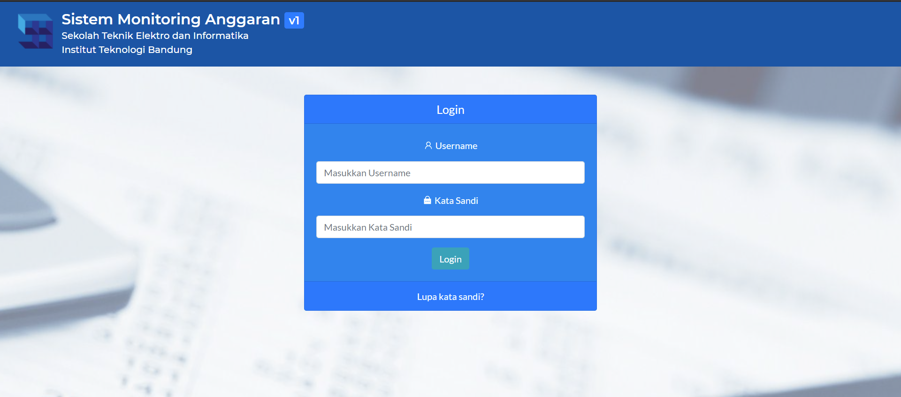

## Lupa Kata Sandi

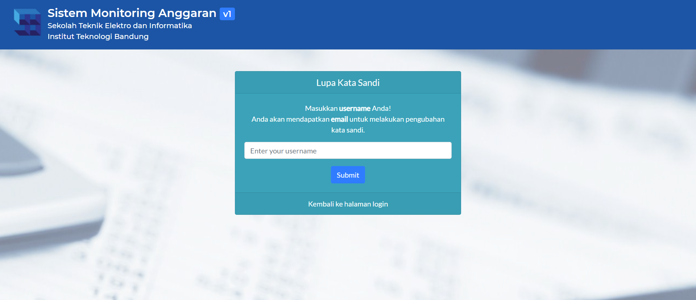

## Admin

### Admin Home

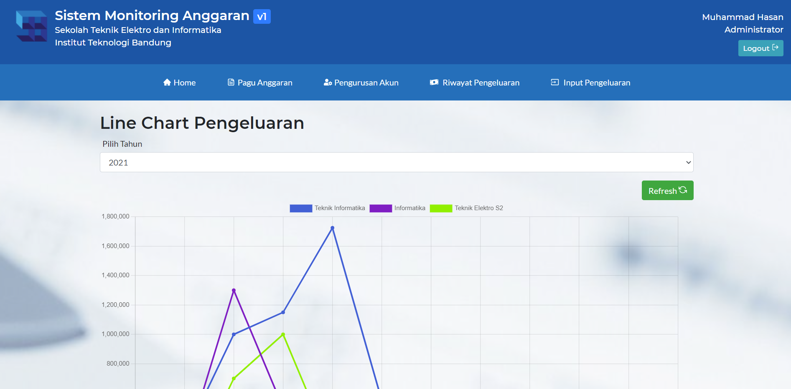

#### Admin Home - Line Chart

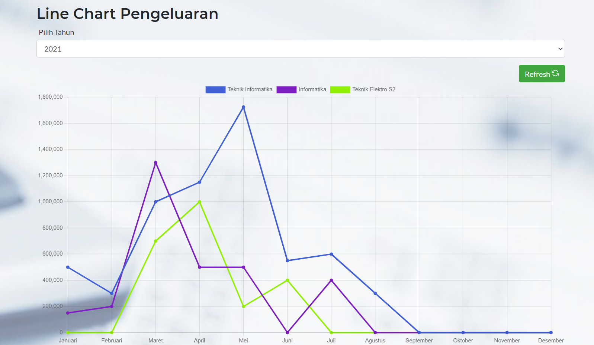

### Admin Pagu Anggaran

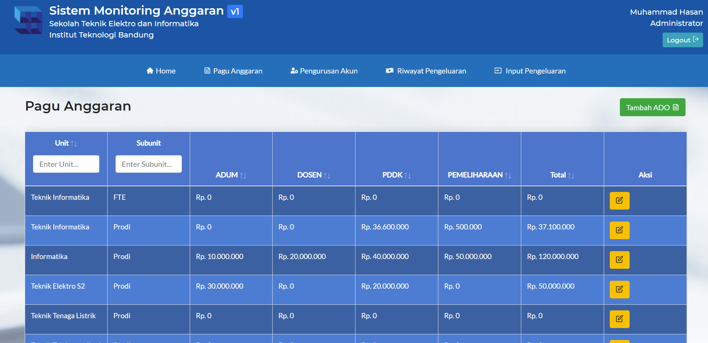

### Admin Pengurusan Akun

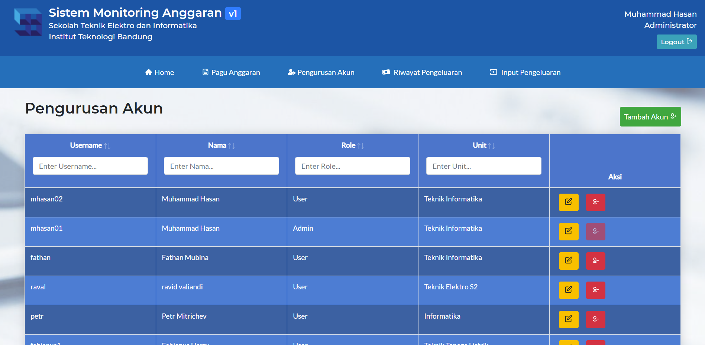

### Admin Riwayat Pengeluaran

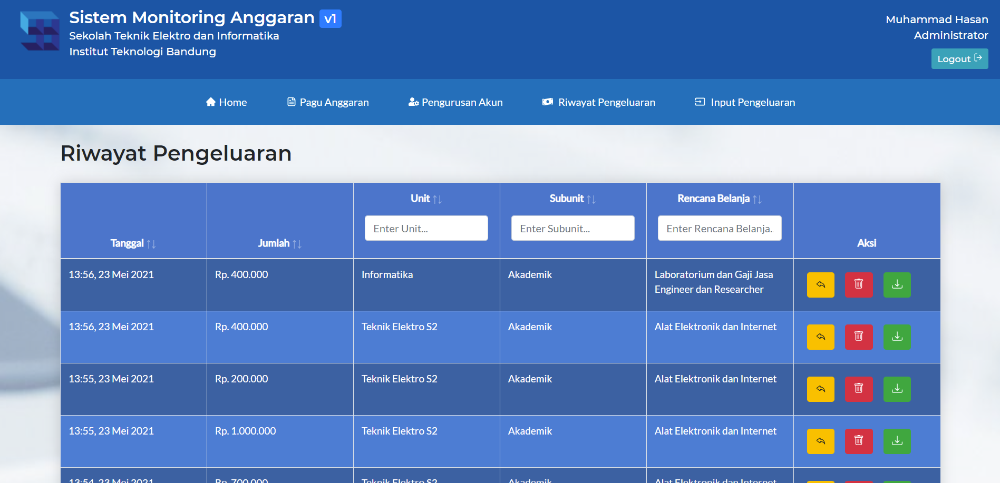

### Admin Input Pengeluaran

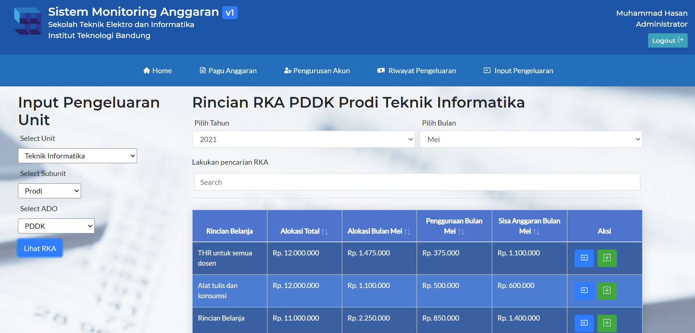

## User

### User Home

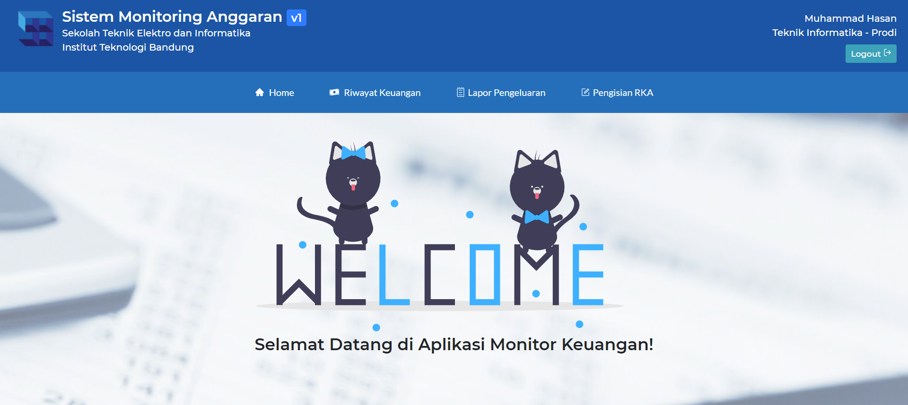

### User Riwayat Keuangan

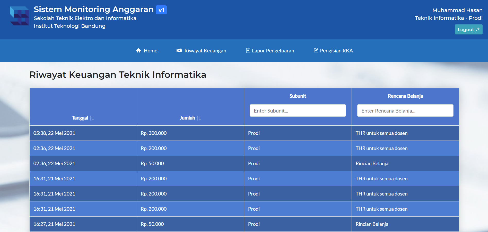

### User Lapor Pengeluaran

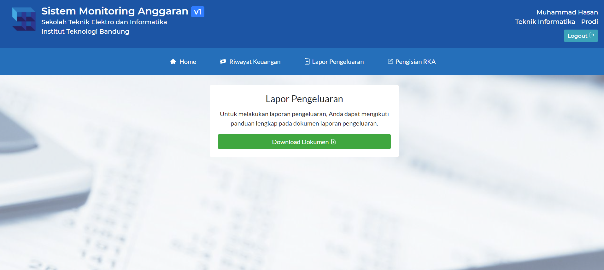

### User Pengisian RKA

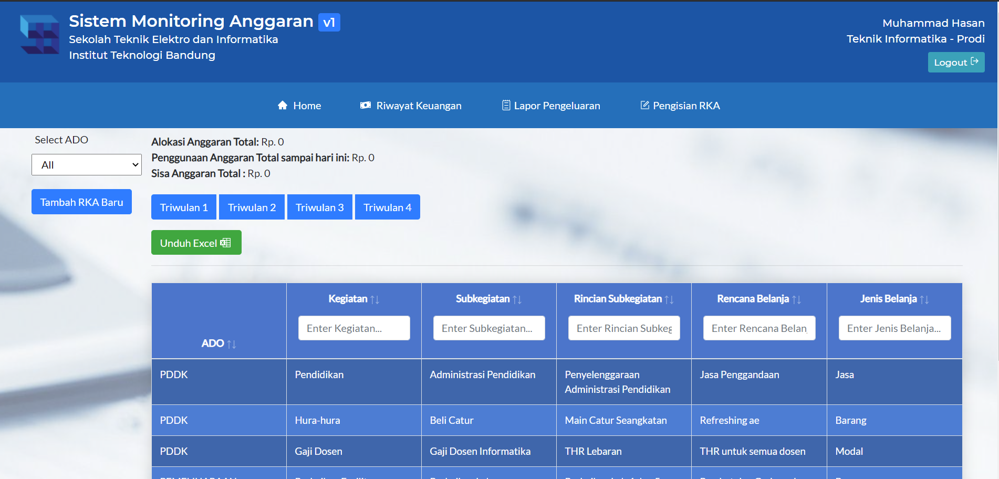

# Kontributor

- Ade Surya Handika (13518007)
- Muhammad Hasan (13518012)
- Fathan Mubina (13518064)
- Muhammad Ravid Valiandi (13518099)
- Fabianus Harry Setiawan (13518144)